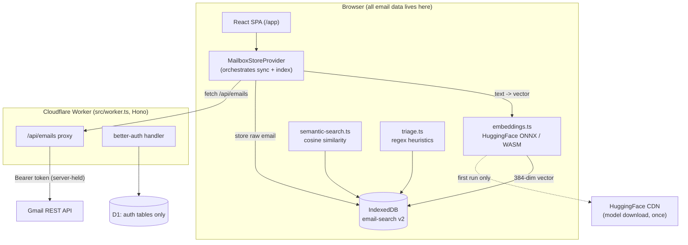

# How Email Manager Works

This is the pedagogical companion to the reference docs. It follows a single
email from Gmail into the browser and back out through search and triage, and
stops at each step to explain **why** it works that way. If you want the
condensed reference tables instead, read [`overview.md`](overview.md); for the
decision rationale in ADR form, read [`decisions.md`](decisions.md).

The one idea that explains almost every design choice: **the server never
touches your mail.** Email bodies, metadata, and the machine-learning
embeddings all live in your browser. The server (a Cloudflare Worker + D1)
stores only your login session. Hold that in mind and the rest follows.

## The mental model



Everything inside the `Browser` box is private to the user's device. The two
things that cross the network are (1) the Gmail proxy call, where the OAuth
token stays server-side, and (2) a one-time model download from HuggingFace.

## Step 1 — Signing in and getting a Gmail token

Auth is Google OAuth via [`better-auth`](https://www.better-auth.com/). The
config lives in `src/lib/auth.ts`. Two details carry the whole design:

- **Scope is `gmail.readonly`.** The app cannot compose, reply, archive, or
  delete. The single non-read action — unsubscribe — always requires an
  explicit click. This is enforced at the OAuth grant, not just in the UI.
- **`accessType: 'offline'` + `prompt: 'consent'`** guarantees Google issues a
  *refresh* token. Access tokens expire after ~1 hour; the refresh token lets
  the server mint new ones without asking the user to sign in again.

The refresh is centralized in `src/lib/get-access-token.ts`. Every Gmail proxy
route calls `getGmailAccessToken`, which calls
`auth.api.getAccessToken({ providerId: 'google', ... })`. better-auth returns
the stored access token and *transparently refreshes it* when it is about to
expire. The code comment records why this matters: an earlier version read
`accessToken` straight from the DB and never refreshed, so Gmail calls started
401-ing an hour after sign-in and force-signed users out.

The session, account, and refresh token live in Cloudflare D1
(`email-manager-auth`) via Drizzle — the *only* thing the server persists.

## Step 2 — Fetching mail through the Worker proxy

The browser never receives the OAuth token. All Gmail reads go through the
Worker (`src/worker.ts`), which holds the token server-side. See
[ADR-008](decisions.md) for why (token stays out of client JS; retry logic
lives in one place).

The route handler `GET /api/emails` calls `listEmails` in `src/lib/gmail.ts`.
That module is where the real Gmail work happens:

- **Two-phase fetch.** Gmail's `messages.list` returns only IDs, so the code
  then fetches each message individually. To stay under rate limits it fetches
  in `BATCH_SIZE = 25` at a time with `Promise.all` per batch.
- **429 backoff.** `gmailFetch` retries up to 3 times on HTTP 429 with
  exponential backoff (1s, 2s, 4s: `1000 * 2 ** attempt`). Gmail's per-user
  quota is easy to trip when hydrating a large inbox, so this is load-bearing.
- **`metadataOnly` mode.** For lists that only need headers (subject, from,
  unsubscribe detection), the code requests Gmail's `format=metadata` with a
  fixed header allowlist — roughly 10× faster than pulling and base64-decoding
  every body.

`parseMessage` normalizes each raw Gmail message into the flat `Email`
interface. Two subtle bits worth reading in the source: `decodeBody` walks the
MIME `parts` tree preferring `text/html` then `text/plain`; and the
`List-Unsubscribe` header is parsed to prefer the **HTTPS one-click endpoint**
over a `mailto:` even when the mailto appears first — this is what makes safe
one-click unsubscribe possible later.

## Step 3 — Caching into IndexedDB

Fetched emails are persisted client-side by `src/lib/db.ts`, an `idb` wrapper
around IndexedDB database `email-search` (currently **version 2**). It has two
stores:

- `emails` — keyed by `id`, with a `by-date` index. Each record is a
  `StoredEmail`, which is an `Email` plus `embedding: number[] | null`. The
  embedding starts `null` and is filled in later (Step 4).
- `meta` — added in v2, holds the `inbox-sync` cursor (`nextPageToken`,
  `exhausted`, `lastSyncedAt`) so sync can resume where it left off.

The sync loop itself is `ensureInboxEmails` in `src/lib/inbox-sync.ts`. It
pages `/api/emails?label=INBOX` until it reaches a target count or the inbox is
exhausted, storing each batch and advancing the saved page cursor. A key detail:
before storing, it looks up any *existing* embedding for each id
(`embeddingById.get(e.id) ?? null`) so re-syncing fresh metadata does not throw
away the vector you already computed.

This is **pull-on-demand** ([ADR-009](decisions.md)) — there is no background
sync, cron, or Gmail push. The inbox is only as fresh as the last load, and in
exchange the server holds no sync state at all.

Why IndexedDB and not a server DB ([ADR-003](decisions.md))? If the server is
breached, no mailbox data leaks; there are no GDPR/CCPA storage obligations for
email content; and localStorage is far too small for thousands of email bodies.
The tradeoff is honest: clearing browser storage wipes the cache, and there is
no multi-device access.

## Step 4 — Embedding, client-side

This is the heart of the "local-first ML" claim. `src/lib/embeddings.ts` loads
a HuggingFace Transformers feature-extraction pipeline running the ONNX runtime
on a WASM backend — **entirely in the browser**:

```ts
pipelineInstance = await pipeline('feature-extraction', 'Xenova/all-MiniLM-L6-v2', {
  dtype: 'fp32',
});
```

- The model, `Xenova/all-MiniLM-L6-v2`, downloads once (~23 MB) from the
  HuggingFace CDN and is cached by the browser. It produces a **384-dimensional
  vector** per input.
- `embed()` calls the pipeline with `{ pooling: 'mean', normalize: true }`.
  Mean-pooling turns per-token vectors into one sentence vector; **normalize**
  makes every vector unit-length, which is what lets search use a plain dot
  product for cosine similarity later (Step 5).
- `prepareEmailText()` is deliberately small: it strips HTML, then builds
  `"{subject}. From {sender}. {first 500 chars of body}"`. Truncating to 500
  chars keeps embedding fast and focuses the vector on what a person would
  actually search for.
- The module guards `typeof window === 'undefined'` and throws server-side —
  the model is import-time client-only.

The orchestration lives in `src/lib/email-index.ts` (`indexEmailsForSearch`).
It pulls unembedded emails via `getEmailsWithoutEmbedding`, sorts newest-first,
takes up to `SEMANTIC_INDEX_LIMIT = 500`, warms the model with a throwaway
`embed('warmup')`, then loops: embed the text, write the vector back onto the
record with `storeEmail`. It reports progress and honors an abort signal so the
UI stays responsive.

Why client-side at all ([ADR-001](decisions.md))? Privacy — email text never
leaves the device; zero per-user inference cost; and Cloudflare Workers cannot
run `onnxruntime-node` native binaries anyway. The cost is the one-time model
download and single-threaded WASM on older devices.

## Step 5 — Semantic search

`semanticSearch(query)` in `src/lib/semantic-search.ts` does the retrieval:

1. Embed the query and load all stored emails **in parallel** (`Promise.all`).
2. Keep only emails that have an embedding.
3. Score each with `dotProduct(queryVector, emailVector)`. Because both vectors
   were normalized at embed time, the dot product *is* cosine similarity — no
   division, no magnitude bookkeeping. This is the payoff for `normalize: true`
   back in Step 4.
4. Nudge the score with small keyword boosts: `+0.05` if the subject contains
   the query string, `+0.03` if the sender does. This rescues exact-match
   lookups that pure vector similarity can rank slightly low.
5. Sort by score and return the top `MAX_RESULTS = 50`.

The UI (`src/components/SemanticSearch.tsx`) reads sync/index state from the
`MailboxStoreProvider`, debounces the query 400ms, and surfaces the two-phase
"Sync & Index" flow: sync mail into IndexedDB, then generate embeddings. Search
is disabled until at least one email is indexed.

## Step 6 — Triage (no ML needed)

Not everything uses embeddings. `src/lib/triage.ts` is pure, synchronous, and
regex-driven. `triageEmails()` scores each message and sorts it into one of
four queues — `respond`, `review`, `unsubscribe`, `reference` — using pattern
sets (e.g. `respondPatterns` matches "can you / following up / feedback";
`urgencyPatterns` matches "today / deadline / meeting"). Signals like
`UNREAD`, `STARRED`, and the presence of an unsubscribe link adjust a numeric
score that maps to high/medium/low priority.

This is intentionally *not* an LLM or embedding task: triage runs instantly on
every load with no model download, and the rules are auditable and predictable.
It powers the keyboard-driven `#today` batch triage view.

## Step 7 — Unsubscribe (the one write path)

`POST /api/emails/:id/unsubscribe` in `src/worker.ts` implements
[RFC 8058](https://www.rfc-editor.org/rfc/rfc8058) one-click unsubscribe. It
fetches only the message metadata (headers), refuses anything that is not an
`https:` `List-Unsubscribe-Post` target, and POSTs
`List-Unsubscribe=One-Click`. On failure it returns the fallback URL for the
user to open manually. It is the only action that changes anything, and it is
always user-initiated.

## Where to go next

- [`overview.md`](overview.md) — reference tables: tech stack, repo layout,
  API routes, IndexedDB and D1 schema.
- [`decisions.md`](decisions.md) — ADR-001…009, the *why* behind each choice.
- [Durable learnings](../knowledge/learnings/lessons.md) — Transformers.js,
  IndexedDB, Workers, and OAuth gotchas found the hard way.
- [External references](../knowledge/learnings/external-references.md) —
  authoritative sources for the concepts above.
