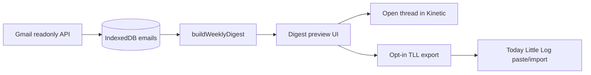

# Email memories and personal digest — product brief

**Status:** Shipped (2026-06-20) — the builder and `#digest` UI landed through the later weekly-digest PRD; unimplemented follow-on phases are deferred in `PROJECT_STATUS.md`, not active backlog.
**Source:** [saas-ideas consolidation](https://github.com/sarthakagrawal927/saas-ideas) @ `aba1a83`, via SaaS Maker Symphony `45a9d3f6-ac51-4710-902f-c9e51d67766a`  
**Product:** Kinetic / `email-manager`  
**Date:** 2026-06-04

## Problem statement

Inbox tools optimize for *now* (triage, search, unsubscribe). The saas-ideas “email memories” and “personal reporter” cluster asked for a **private, local** loop that surfaces:

- relationships that went quiet,
- threads worth revisiting,
- weekly themes in what you actually received.

Kinetic already stores mailbox metadata and embeddings in **IndexedDB** (`src/lib/db.ts`) and computes sender analytics client-side. This brief defines how to turn that cache into a **personal digest** without new OAuth scopes, server storage, or automated outbound email.

## Goals (when implemented)

| Goal | Hypothesis |
|------|------------|
| Reconnection | User opens ≥1 “gone quiet” contact from digest per week |
| Follow-through | User opens ≥1 “thread to revisit” per digest |
| Reflection | User reads weekly themes without leaving the app |
| Optional journal | ≥5% of digest viewers opt in to export a summary to Today Little Log |

## Non-goals

- Commercial “AI reporter” product or scheduled email *to* the user
- New Gmail scopes (`gmail.modify`, send, labels write)
- Server-side digest storage, cron, or push notifications
- LLM-generated prose in v1 (deterministic stats + optional on-device embeddings only)
- Cross-account or family sharing of digest content

## Privacy boundaries

| Boundary | Rule |
|----------|------|
| Data location | Digest inputs and outputs stay in **browser storage** (IndexedDB + optional `localStorage` prefs). Never written to D1 or Workers KV. |
| Network | Digest build is **offline-capable** once IndexedDB is populated. No digest API route in v1. |
| Identifiers | Digest export uses **hashed sender keys** (`sha256` of normalized email) in cross-app payloads; display names only inside Kinetic. |
| Embeddings | Weekly themes may use existing local embeddings; theme labels are **counts/clusters**, not raw message bodies in exports. |
| Third parties | No PostHog events containing subject lines, snippets, or sender addresses unless explicitly opted in later. |
| Today Little Log | Export is **manual, opt-in, one screen at a time**; no background sync. |

## Retention rules

| Artifact | Default retention | User control |
|----------|-------------------|--------------|
| IndexedDB emails | Until user clears site data or uses in-app “clear local cache” (future) | Browser “clear site data” |
| Digest snapshots | **90 days** rolling in IndexedDB store `digests` (planned v2) | Toggle “keep digests” off → stop writing; purge button |
| Digest prefs | `localStorage` key `email-manager:digest:*` | Cleared with site data |
| TLL export files | User-owned after download; not retained by Kinetic | N/A |

v1 (this task) does **not** add IndexedDB schema upgrades—only documents retention and ships pure `buildWeeklyDigest()` over existing `StoredEmail` rows.

## Digest definition (local / private)

A **weekly digest** is a JSON document generated on-device:

```ts
interface WeeklyDigest {
  format: "email-manager-weekly-digest";
  formatVersion: 1;
  periodStart: string; // ISO date (Monday UTC)
  periodEnd: string;
  generatedAt: string;
  relationshipsQuiet: RelationshipQuiet[];  // was active, now silent
  threadsToRevisit: ThreadRevisit[];        // starred / long / unanswered patterns
  weeklyThemes: WeeklyTheme[];              // top subjects/domains + optional embedding clusters
}
```

### Signal sources (all local)

| Section | Signals | Notes |
|---------|---------|-------|
| **Old relationships** | Sender frequency by month; compare last 90d vs prior 90d | Flag senders with ≥3 messages historically and **zero** in last 60d |
| **Threads to revisit** | `threadId`, `labelIds` (STARRED), age >14d, user never opened in app (future: local open log) | v1: starred + last message in thread older than 14d |
| **Weekly themes** | Domain + keyword buckets from subjects/snippets; optional k-means on embeddings | Reuse `Analytics` aggregation patterns; cap 5 themes |

### Personal digest loop



**Cadence:** user-triggered “Generate this week” on first ship; later optional `localStorage` reminder (“Sunday digest”) with no server cron.

## Opt-in export to Today Little Log

Today Little Log (TLL) is a separate daily scoreboard app. Kinetic should not assume TLL auth.

**v1 export shape** (`email-manager-tll-digest-export`):

- `date` — digest week ending (ISO)
- `summary` — ≤500 chars deterministic text (counts only, no subjects)
- `axes` — optional scoreboard axes, e.g. `{ id: "inbox-relationships", label: "People to reconnect", value: 3 }`
- `source: "email-manager"` + `project_id` for manual import

**UX:** Digest preview → “Copy for Today Little Log” → clipboard JSON or markdown bullet list. User pastes into a TLL journal note or custom scoreboard item. **No OAuth bridge** between apps in v1.

If TLL later adds a generic `POST /api/import-note` with user consent, Kinetic can gate behind explicit “Connect” — out of scope here.

## Implementation phases

| Phase | Scope | Risk |
|-------|-------|------|
| **0 (this task)** | Brief + `src/lib/digest.ts` + fixtures under `fixtures/` | None — no auth/deploy |
| **1** | IndexedDB `digests` store + `#digest` view (read-only preview) | Low — client only |
| **2** | Open tracking in IndexedDB for “revisit” accuracy | Low |
| **3** | Embedding-based theme labels (on-device) | Medium — CPU/battery |
| **4** | TLL deep link or import API if TLL ships importer | Cross-app consent |

## Fixture-backed mock (phase 0)

- Input: `fixtures/digest-sample-emails.json` (synthetic `Email`-shaped rows)
- Output: `fixtures/weekly-digest-sample.json` (golden digest)
- Logic: `src/lib/digest.ts` — `buildWeeklyDigest(emails, options?)`

Verify locally:

```bash
pnpm typecheck
node scripts/verify-digest-fixture.mjs
```

## Evaluation

**Fit:** Strong. IndexedDB + sender analytics + semantic search already match "Personal Memory OS" fleet direction (saas-ideas consolidation — see `saas-maker/docs/ideas/saas-ideas-consolidation-2026-06-03.md` in the fleet workspace).

**Decision:** **Proceed to phase 1** only after manual dogfood of fixture preview; keep commercial scope at zero unless weekly active digest users appear.

## Open questions

1. Should “quiet relationship” exclude newsletters (`triage.ts` keyword list)?
2. Store per-thread “last opened in Kinetic” vs infer from selection events only?
3. Is a single `#digest` nav item enough, or fold into existing `#analytics`?

## Related code (today)

| Area | Path |
|------|------|
| Local store | `src/lib/db.ts` |
| Sender stats | `src/components/Analytics.tsx` |
| Semantic recall | `src/lib/semantic-search.ts` |
| Newsletter heuristics | `src/lib/triage.ts` |
| JSON export (emails) | `db.exportEmails()` |

## Acceptance mapping

| Criterion | Evidence |
|-----------|----------|
| Local/private digest defined | Sections above + `WeeklyDigest` types in `src/lib/digest.ts` |
| No secrets/OAuth changes | No edits to `auth.ts`, wrangler, or `.env*` |
| Privacy + retention + TLL opt-in | Tables in this doc |
| Brief or fixture mock | This file + `fixtures/*` + `scripts/verify-digest-fixture.mjs` |
